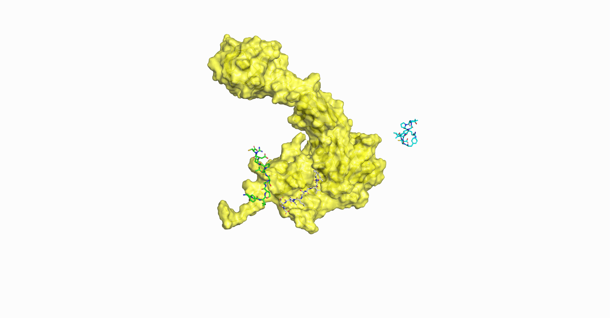

# RAPiDock: Pushing the Boundaries of Protein-peptide Docking with Rational and Accurate Diffusion Generative Model

------


## Table of Contents:

------

- [Description](#description)
- [Software prerequisites](#software-prerequisites)
- [Installation Guide](#Installation-Guide)
  - [Clone the current repo](#Clone-the-current-repo)
  - [Download Pre-trained models and data](#Download-Pre-trained-models-and-data)
  - [Install option 1: Install via conda .yaml file](#Install-option-1-Install-via-conda-yaml-file)
  - [Install option 2: Install manually](#Install-option-2-Install-manually)
  - [Install option 3: Install manually for higher versions of CUDA](#Install-option-3-Install-manually-for-higher-versions-of-CUDA)
  - [Install option 4: Install via Dockerfile](#Install-option-4-Install-via-Dockerfile)
- [Protein-peptide Docking](#Protein-peptide-docking)
  - [Docking prediction](#docking-prediction)
  - [Reproduce Results](#Reproduce-Results)
  - [Input formats for RAPiDock in different docking scenarios](#Input-formats-for-RAPiDock-in-different-docking-scenarios)
    - [Local docking](#Local-docking)
    - [Global docking](#Global-docking)
    - [Virtual screening](#Virtual-screening)
    - [Customized multi-tasks](#Customized-multi-tasks)
  - [Supported residues](#supported-residues)
  - [Supported parameters of RAPiDock](#Supported-parameters-of-RAPiDock)
  - [Visualization](#Visualization)

## Description

-------------

RAPiDock is a diffusion generative model designed for rational, accurate, and rapid protein-peptide docking at an all-atomic level.

## Software prerequisites

--------------------

RAPiDock relies on external software/libraries to handle protein and peptide dataset files, to compute atom features, and to perform neural network calculations. The following is the list of required libraries and programs, as well as the version on which it was testes.

- [ ] [Python](https://www.python.org/) (3.9).
- [ ] [Pytorch](https://pytorch.org/) (1.11.0). Use to model, train, and evaluate the actual neural networks.
- [ ] [CUDA Toolkit](https://developer.nvidia.com/cuda-toolkit) (11.5.1). 
- [ ] [PyG](https://www.pyg.org/) (2.1.0). Used for implementing neural networks.
- [ ] [MDAnalysis](https://www.mdanalysis.org/) (2.6.1). To handle residue acids related data.
- [ ] [BioPython](https://github.com/biopython/biopython) (1.84). To parse PDB files.
- [ ] [E3NN](https://e3nn.org/) (0.5.1). Used to implement E(3) equivariant neural network.
- [ ] [RDKit](https://www.rdkit.org/) (2022.9.5). Used to process and extract atomic features.
- [ ] *[PyRosetta](https://www.pyrosetta.org/) (2024.10). Used to further optimize the peptides generated by the model and rescore the generated peptide. (**Optional**)

## Installation Guide

-------------

We will set up the environment using [Anaconda](https://docs.anaconda.com/anaconda/install/index.html) or [Docker](https://www.docker.com/) Tools.

### Clone the current repo

```shell
git clone https://github.com/huifengzhao/RAPiDock.git
```

### Download Pre-trained models

**Pre-trained models**: We have provided two different pre-trained model's parameters:  [rapidock_local.pt](https://zenodo.org/records/14193621/files/rapidock_local.pt?download=1) for local docking and [rapidock_global.pt](https://zenodo.org/records/14193621/files/rapidock_global.pt?download=1) for global docking. Download them and then correctly put into `train_models/CGTensorProductEquivariantModel` in order for the model to run normally.

### Install option 1: Install via conda .yaml file

We can easy install the environment by using the provided ***rapidock_env.yaml*** and ***requirement.txt*** files. <u>These configuration files are compatible with **CUDA 12.4**.</u>

```shell
conda env create -f rapidock_env.yaml -n RAPiDock
conda activate RAPiDock # activating the constructed environment
pip install -r requirement.txt # We separated the dependencies of conda and pip for a better experience of environment installation.
python -c 'import pyrosetta_installer; pyrosetta_installer.install_pyrosetta()' # Installation of PyRosetta (Optional)
```

### Install option 2: Install manually

If we fail to install the environment via provided `.yaml` file, we can also install the environment manually through the following steps:

```shell
conda create -n RAPiDock python=3.9 pytorch=1.11.0 cudatoolkit=11.5.1 pyg=2.1.0 pytorch-cluster pytorch-scatter pytorch-sparse MDAnalysis=2.6.1 mkl=2023.1.0 pyyaml -c pytorch -c nvidia -c pyg -c conda-forge 
pip install e3nn==0.5.1 rdkit-pypi==2022.9.5 fair-esm==2.0.0 pyrosetta-installer==0.1.0
python -c 'import pyrosetta_installer; pyrosetta_installer.install_pyrosetta()' # Installation of PyRosetta (Optional)
```

### Install option 3: Install manually for higher versions of CUDA

If we are using higher versions of CUDA, such as CUDA 12.6 on H800, the PyTorch and other packages used in the aforementioned method will no longer be compatible. Therefore, we should install the environment manually through the following steps:

```shell
conda create -n RAPiDock python=3.9 pytorch torchvision torchaudio pytorch-cuda=12.4 MDAnalysis pyg pytorch-cluster pytorch-scatter pytorch-sparse pyyaml -c pytorch -c nvidia -c pyg -c conda-forge
pip install e3nn rdkit-pypi fair-esm pyrosetta-installer
python -c 'import pyrosetta_installer; pyrosetta_installer.install_pyrosetta()' # Installation of PyRosetta (Optional)
```

### Install option 4: Install via Dockerfile

If we are not accustomed to using Conda for environment configuration, we also provide a ***Dockerfile***, which is suitable for more general scenarios. We can easily build the environment through the following steps:

```bash
docker build --no-cache -t rapidock-image . # build the image
docker run -it --runtime=nvidia rapidock-image /bin/bash # step into the image we build for RAPiDock running 
```

Then, we have built the environment required for the model and can proceed with the subsequent code.

## Protein-peptide Docking

----------------------

Now, we can run the code as described below.

### Docking prediction

We are ready to run inference. To test the model, an example dataset is provided in the `data/` directory.

```shell
python inference.py --config default_inference_args.yaml --protein_peptide_csv data/protein_peptide_example.csv --output_dir results/default
```

By default, we will use 5 CPUs for computing, if we want to change the number of CPUs, we can simply:

```shell
python inference.py --config default_inference_args.yaml --protein_peptide_csv data/protein_peptide_example.csv --output_dir results/default --cpu 10
```

----------------------

### Reproduce Results

We offer several processed datasets, including two primary test sets for model performance evaluation—[RefPepDB-RecentSet](https://zenodo.org/records/14193621/files/RefPepDB-RecentSet.tar.gz?download=1) and  [PepSet](https://zenodo.org/records/14193621/files/pepset.tar.gz?download=1)—and datasets for extensive [case analyses](https://zenodo.org/records/14193621/files/cases.tar.gz?download=1), covering four key application scenarios: PLK-PBD, SHP2, Import-a, and pHLA.

Each dataset is organized as follows:

```
Dataset Name/
    PdbID/
        protein.pdb
        peptide.pdb
        peptide_sequence
    PdbID/
        ...
```

Take dataset RefPepDB-RecentSet for example:

1. **Download and Extract Dataset**

   Download [`RefPepDB-RecentSet.tar.gz`](https://zenodo.org/records/14193621/files/RefPepDB-RecentSet.tar.gz?download=1) and place it in:

   ```
   /path/to/RAPiDock/testdataset/
   ```

   Extract the dataset:

   ```
   cd /path/to/RAPiDock/testdataset
   tar -xzvf RefPepDB-RecentSet.tar.gz
   ```

   Navigate to the dataset directory and we will see 523 folders named with pdbid of different protein-peptide complexes that make up the RefPepDB-RecentSet

2. **Run Docking for a Single Example** (e.g., `7aos`)

   Return to the `/path/to/RAPiDock/` root directory and execute:

   ```bash
   python inference.py \
       --complex_name 7aos \
       --protein_description testdataset/RefPepDB-RecentSet/7aos/7aos_protein_pocket.pdb \
       --peptide_description $(cat testdataset/RefPepDB-RecentSet/7aos/7aos_peptide_sequence) \
       --output_dir results/RefPepDB-RecentSet \
       --N 10 \
       --model_dir train_models/CGTensorProductEquivariantModel \
       --ckpt rapidock_local.pt \
       --scoring_function ref2015 \
       --batch_size 4 \
       --no_final_step_noise \
       --inference_steps 16 \
       --actual_steps 16 \
       --conformation_partial 1:1:1 \
       --cpu 10
   ```

3. **Visualize Results**
   - Docking results will be saved in the directory specified by `--output_dir`.
   - Predicted protein-peptide binding affinities are stored in `ref2015_score.csv` within the `output_dir`.

--------------------------

### Input formats for RAPiDock in different docking scenarios

We support multiple input formats depending on specific tasks.

#### Local docking

- When we try to perform local docking, the binding pocket and/or the protein structure are always known.  So, we need to prepare:

  - **Protein**: The `.pdb` file of the protein or its pocket (for better accuracy). 

    > 💡
    >
    > The pocket structure of protein can be generated by using `pocket_trunction.py`.

  - **Peptide**: The `.pdb` file or sequence of the peptide. 

    > 📖
    >
    > `.pdb` file of peptide is only used for sequence extracting, and no 3D information of peptide will be kept.

  For example:

  ```shell
  python inference.py [--ohter options] --protein_description protein.pdb --peptide_description peptide.pdb
  ```

  or just using the sequence information:

  ```shell
  python inference.py [--ohter options] --protein_description protein.pdb --peptide_description HKILHRLLQDS
  ```

#### Global docking

- When we try to perform global docking, we have no idea about the binding pocket of the protein, and we even have no idea about the protein structure. So, we need to prepare:

  - **Protein**: The `.pdb` file of the protein or sequence of the protein (We can use the default ESMFold method to fold the protein). 

    > 💡
    >
    > We can also use other ways, such as using [AlphaFold](https://golgi.sandbox.google.com/) or homology modeling to generate the protein structure.

  - **Peptide**: The `.pdb` file or sequence of the peptide. 

  For example:

  ```shell
  python inference.py [--ohter options] --protein_description ...SLAPYASLTEIEHLVQSVCKSYRETCQLRLEDLLRQRSNIFSREEVTGYQ... --HKILHRLLQDS
  ```

#### Virtual screening

- When we try to perform virtual screening, we always have the information about the binding pocket and/or the protein structure, and a multiple sequence of peptides. So, we provide Multi-task submission mode:

  - **Protein and peptide description**: A `.csv` file including  multiple protein-peptide pair information. The `.csv` file looks like:

    | complex_name | protein_description  | peptide_description |
    | :----------: | :------------------: | :-----------------: |
    |   complex1   | /path/to/protein.pdb |     HKILHRLLQDS     |
    |   complex2   | /path/to/protein.pdb |    EKHKILHRLLQDS    |
    |     ...      |         ...          |         ...         |
    |   complexN   | /path/to/protein.pdb |      LSGFMELCQ      |

  Then, we can simply launch the model by using the following command:

  ```shell
  python inference.py [--ohter options] --protein_peptide_csv /path/to/virtual_screening.csv
  ```

#### Customized multi-tasks

- We can also perform multiple customized tasks in one shot, using a `.csv` file. 

  - **Protein and peptide description**: A `.csv` file including  multiple protein-peptide pair information. The `.csv` file looks like:
    | complex_name |                   protein_description                    | peptide_description  |
    | :----------: | :------------------------------------------------------: | :------------------: |
    |   complex1   |                   /path/to/protein.pdb                   |      AAAARLLQDS      |
    |   complex2   | ...SLAPYASLTEIEHLVQSVCKSYRETCQLRLEDLLRQRSNIFSREEVTGYQ... | /path/to/peptide.pdb |
    |     ...      |                           ...                            |         ...          |
    |   complexN   |                   /path/to/protein.pdb                   | /path/to/peptide.pdb |

  Then, we can simply launch the model by using the following command:

  ```shell
  python inference.py [--ohter options] --protein_peptide_csv /path/to/customized_tasks.csv
  ```

--------------------------

### Supported residues

In current version of RAPiDock, we support 92 types of residues for protein-peptide binding pattern prediction. The supported residues are illustrated bellow:


For the use of 92 types of residues, we define a special format for model input:

|   G   |   A   |   V   |   I   |   L   |   M   |   F   |   Y   |   W   |   P   |
| :---: | :---: | :---: | :---: | :---: | :---: | :---: | :---: | :---: | :---: |
|   S   |   T   |   N   |   Q   |   D   |   E   |   C   |   R   |   H   |   K   |
| [HYP] | [SEP] | [TYS] | [ALY] | [TPO] | [PTR] | [DAL] | [MLE] | [M3L] | [DLE] |
| [DLY] | [AIB] | [MSE] | [DPR] | [MVA] | [NLE] | [MLY] | [SAR] | [ABA] | [FME] |
| [DAR] | [ORN] | [CGU] | [DPN] | [DTY] | [DTR] | [4BF] | [DGL] | [DCY] | [MK8] |
| [MP8] | [GHP] | [ALC] | [BMT] | [MLZ] | [DVA] | [3FG] | [DAS] | [7ID] | [DSN] |
| [AR7] | [MEA] | [PHI] | [MAA] | [LPD] | [KCR] | [PCA] | [DGN] | [2MR] | [DHI] |
| [ASA] | [MLU] | [YCP] | [DSG] | [DTH] | [OMY] | [FP9] | [DPP] | [HCS] | [SET] |
| [DBB] | [BTK] | [DAM] | [IIL] | [3MY] | [SLL] | [PFF] | [HRG] | [DIL] | [DNE] |
| [MED] | [D0C] |       |       |       |       |       |       |       |       |

Then, we can simply launch the model for predicting peptide with non-canonical amino acids by using the following command:

```shell
python inference.py [--ohter options] --protein_description protein.pdb --peptide_description HK[HYP]RL[PTR]QDS
```

--------------------

### Supported parameters of RAPiDock

For a detailed description of model parameters, run:

```bash
python inference.py --help
```

Then, we will get all the parameters supported by the `inference.py` of **RAPiDock**:

```
usage: inference.py [-h] [--config CONFIG] [--protein_peptide_csv PROTEIN_PEPTIDE_CSV] [--complex_name COMPLEX_NAME]
                    [--protein_description PROTEIN_DESCRIPTION] [--peptide_description PEPTIDE_DESCRIPTION] [--output_dir OUTPUT_DIR]
                    [--save_visualisation] [--N N] [--model_dir MODEL_DIR] [--ckpt CKPT] [--scoring_function SCORING_FUNCTION] [--fastrelax]
                    [--confidence_model_dir CONFIDENCE_MODEL_DIR] [--confidence_ckpt CONFIDENCE_CKPT] [--batch_size BATCH_SIZE]
                    [--no_final_step_noise] [--inference_steps INFERENCE_STEPS] [--actual_steps ACTUAL_STEPS]
                    [--conformation_partial CONFORMATION_PARTIAL] [--conformation_type CONFORMATION_TYPE] [--cpu CPU]

optional arguments:
  -h, --help            show this help message and exit
  --config CONFIG
  --protein_peptide_csv PROTEIN_PEPTIDE_CSV
                        Path to a .csv file specifying the multiple inputs as described in the README. If this is not None, it will be used
                        instead of the --protein_description and --peptide_description parameters
  --complex_name COMPLEX_NAME
                        Name that the docked complex result will be saved with
  --protein_description PROTEIN_DESCRIPTION
                        Either the path to a protein .pdb file or a sequence of the input protein for ESMFold
  --peptide_description PEPTIDE_DESCRIPTION
                        Either the path to a peptide .pdb file or a sequence of the input peptide
  --output_dir OUTPUT_DIR
                        Directory where the outputs will be written to
  --save_visualisation  Save a .pdb file with all of the steps of the reverse diffusion
  --N N                 Number of samples to generate
  --model_dir MODEL_DIR
                        Path to folder with trained score model and hyperparameters
  --ckpt CKPT           Checkpoint to use for the score model
  --scoring_function SCORING_FUNCTION
                        The scoring function to use (confidence/ref2015)
  --fastrelax           Use FastRelax to optimize generated peptide. This option is on if --scoring_function is chosed to be ref2015
  --confidence_model_dir CONFIDENCE_MODEL_DIR
                        Path to folder with trained confidence model and hyperparameters, this is used if --scoring_function is chosed to be
                        confidence
  --confidence_ckpt CONFIDENCE_CKPT
                        Checkpoint to use for the confidence model, this is used if --scoring_function is chosed to be confidence
  --batch_size BATCH_SIZE
                        The batch size used in inference process
  --no_final_step_noise
                        Use no noise in the final step of the reverse diffusion
  --inference_steps INFERENCE_STEPS
                        Number of denoising steps
  --actual_steps ACTUAL_STEPS
                        Number of denoising steps that are actually performed
  --conformation_partial CONFORMATION_PARTIAL
                        The partial of initial type of peptide conformation. H:E:P.
  --conformation_type CONFORMATION_TYPE
                        The initial type of peptide conformation. H: Helical conformation: φ = -57°, ψ = -47°; E: Extended conformation: φ =
                        -139°, ψ = 135°; P: Polyproline II conformation: φ = -78°, ψ = 149°, this is ignored if --conformation_partial is not
                        None
  --cpu CPU             The cpu used in inference process
```
Note: A confidence model module was implemented during early development, but we ultimately used Rosetta’s scoring function for more stable results, so the confidence model is not included in the final workflow.

--------------------

### Visualization

We also provide visualization of the model inference process. We can simply:

```
python inference.py --config default_inference_args.yaml --protein_peptide_csv data/protein_peptide_example.csv --output_dir results/default --save_visualisation
```

Then the inference process of generated peptide will be save by name of `rankN_reverseprocess.pdb`



hope you enjoy the processing of using RAPiDock.
